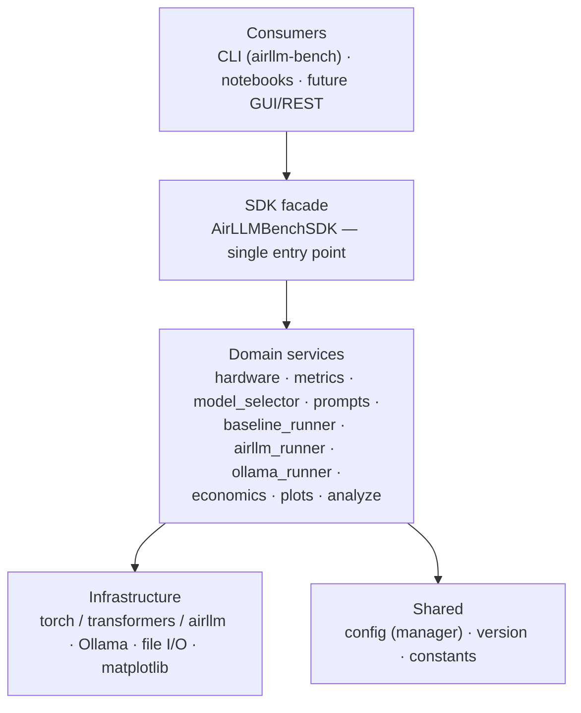

# EX05 — Running a Massive LLM Locally: AirLLM, Quantization & Performance Benchmarking

| | |
|---|---|
| **Group** | NajAmjad |
| **Course** | AI Orchestration |
| **Instructor** | Dr. Yoram Segal |
| **Date** | June 2026 |

> A reproducible, instrumented experiment that runs a large language model
> **on-premises** on a modest 8 GB laptop using **AirLLM** layer-streaming, plus
> a **GGUF quantization** comparison via Ollama, analysed both technically and
> economically.

**Full technical report:** [`reports/report.md`](reports/report.md).

> All numbers in this README are **real, measured** results from the machine in
> §1, generated from the raw `results/*.json` by `airllm-bench analyze`. Every
> figure regenerates from that raw data — nothing is hand-entered.

---

## 1. Hardware spec & model choice (Task 5.1)

Auto-detected by `python -m src.hardware` → [`results/hardware.json`](results/hardware.json):

| Field | Value (this machine) |
|---|---|
| OS | Windows 10 |
| CPU | Intel Core i7-7500U @ 2.70 GHz — **2 physical / 4 logical cores** |
| RAM | **7.9 GB** total |
| GPU / VRAM | NVIDIA GeForce GTX 950M / **2.0 GB** (Maxwell, compute 5.0) |
| Disk | **SSD** (Micron 1100 SATA), ~40 GB free |
| Python | 3.12 (uv-managed; pinned `>=3.10,<3.13`) |

**Model chosen:** `Qwen/Qwen2.5-7B-Instruct`.
**Why this is the right "big enough to hurt, not impossible" pick *for this machine*:**
its FP16 footprint (~15 GB) **far exceeds the 7.9 GB RAM**, so the naive baseline
is guaranteed to fail (the bottleneck is real and demonstrable). Yet its
per-layer shards fit the ~40 GB SSD and a single transformer layer fits in RAM —
exactly the regime where AirLLM earns its keep. A 14B/32B model would not fit the
free disk once shards are written; 72B is far out of reach. `src.model_selector`
reproduces this reasoning from the detected RAM + free disk.

---

## 2. What the experiment does

1. **Baseline (Task 5.2)** — load the model the naive way
   (`transformers.AutoModelForCausalLM`, full FP16 weights). On 7.9 GB RAM this
   OOMs / thrashes swap. **That failure is the bottleneck evidence**, captured
   verbatim in `results/baseline_*.json`.
2. **AirLLM (Task 5.3, fit-the-model axis)** — the same prompt through AirLLM,
   which streams **one transformer layer at a time** from the SSD. This is the
   layer-streaming demonstration that makes the otherwise-impossible model run;
   AirLLM is run at **FP16** (see the note below on why its own Q4/Q8 path is not
   used on this GPU).
3. **Quantization (Task 5.3, shrink-the-model axis)** — **FP16 vs Q8 vs Q4** is
   measured with **GGUF via Ollama** (llama.cpp, CPU), the engine that can
   actually quantize on this hardware. Task 5.3 asks for *both* AirLLM *and* a
   quantization sweep; we deliberately assign each to the engine that can run it
   here — AirLLM for layer-streaming (FP16), GGUF for the quant sweep — because
   **AirLLM's own Q4/Q8 needs `bitsandbytes` (CUDA ≥ 7.5, several GB VRAM), which
   the GTX 950M (Maxwell 5.0, 2 GB) cannot provide.** This split is a design
   decision forced by the hardware, documented in `docs/PRD_quantization.md`, not
   an omission — together the two engines cover the full FP16→Q8→Q4 sweep the task
   requires.
4. **Measure (Task 5.4)** — TTFT, ITL/TPOT, throughput, peak RAM/VRAM, energy.
5. **Economics (Task 5.5)** — On-Prem CAPEX/OPEX vs third-party API, with
   optional cloud-GPU and prompt-caching scenarios; compute the break-even volume.

Measurement tools: a background `MemorySampler` thread (peak RSS + CUDA peak), a
streaming timer for TTFT/per-token gaps, Ollama's native ns-precision counters
for the GGUF runs, and `matplotlib` for all figures.

---

## 3. Results summary (measured)

`airllm-bench analyze` writes `results/summary_table.md` and the figures from the
raw `results/*.json`. Real measurements on the machine in §1
(Qwen2.5-7B-Instruct, "short" prompt, 20 output tokens):

| Config | Quant | TTFT (s) | TPOT (ms) | tok/s | Total (s) | Peak RAM (GB) | Energy (Wh) | Status |
|---|---|---|---|---|---|---|---|---|
| baseline (HF direct) | fp16 | — | — | — | — | — | — | **expected OOM ✓ — bottleneck confirmed** |
| airllm | fp16 | 122.61 | 128,494 | 0.01 | 2564 | 3.6 | 11.19 | ok |
| ollama (GGUF) | q4 | 52.13\* | 295.7 | **3.56** | 57.7 | 4.2 | 0.24 | ok |
| ollama (GGUF) | q8 | 234.38 | 28,140 | 0.04 | 769.0 | 5.0 | 3.20 | ok |

\* Q4's TTFT includes the **one-time model load into RAM** (~48 s on first call);
the warm prefill is ~4.5 s — see the input-length study below.
Peak RAM is the measured RSS of the **Ollama process tree**, and it confirms the
cliff: Q4 sits at **~4.2 GB** (≈ its ~4.4 GB footprint → fits 8 GB), while Q8 can
hold only **~5.0 GB** resident before RAM runs out and the rest of its ~8 GB pages
from disk → 0.04 tok/s.

**Reading the data.**
- **Baseline fails:** the 15 GB FP16 model cannot be placed in 8 GB RAM with
  offloading forbidden — the OS kills the load. This *is* the memory-capacity
  bottleneck (recorded in `results/baseline_short.json`).
- **AirLLM enables it, slowly:** the same model runs in just **3.6 GB peak RAM**
  by streaming one layer at a time from the SSD — but each token re-reads all
  layers from disk, so decode is ~**128 s/token** (0.01 tok/s). Classic
  disk-I/O-bound behaviour.
- **Quantization + fitting in RAM is the real win:** **Q4 (~4.2 GB measured) fits
  in RAM** → **3.56 tok/s** decode (296 ms/token, **~430× faster** than AirLLM's
  128 s) at ~0.24 Wh/request (**~47× less energy** than AirLLM's 11.19 Wh).
- **The RAM cliff:** **Q8 (~8 GB) does *not* fit** (only ~5 GB stays resident) →
  llama.cpp pages the rest from disk every token → collapses to 0.04 tok/s
  (~**95× slower** than Q4). The decisive factor is not the quantization level
  itself but **whether the working set fits in RAM** — and the peak-RAM column
  shows it directly.
- **Output quality per level (5.4)** — a brief note, since the brief states quality
  is not this work's focus: FP16 is the reference; **Q8 (`q8_0`)** is near-lossless;
  **Q4 (`q4_K_M`)** shows only minor degradation, acceptable for general use. So the
  limiting "red line" here is feasibility, not accuracy — Q4 is good enough at a
  usable speed, while Q8 is unusable on this hardware.

> Note: Ollama runs in a separate process, so peak RAM is sampled from the Ollama
> process tree (not this script's RSS). See `docs/PRD_quantization.md`.


### Parameter study — TTFT vs input length (Task 5.7 secondary extension)

Ollama Q4 across three prompt lengths (`airllm-bench study`). Reading the **warm**
runs (the first call also pays the one-time model load), prefill cost (TTFT)
clearly grows with input length while decode (TPOT) stays roughly flat — exactly
the compute-bound-prefill / memory-bound-decode split:

| Prompt | Input tokens | TTFT (s) | TPOT (ms) | tok/s | Total (s) |
|---|---|---|---|---|---|
| short | ~12 | 52.13 (incl. cold-start load) | 295.7 | 3.56 | 57.7 |
| medium (warm) | ~40 | 4.49 | 266.3 | 3.78 | 46.8 |
| long_context (warm) | ~620 | 63.97 | 466.4 | 2.16 | 114.8 |


### Run evidence (screenshots)

**Parameter study — `airllm-bench study`:**


**Analysis output — `airllm-bench analyze`:**


**Tests passing — `pytest`:**


---

## 4. Inference-concept analysis (Task 5.6)

- **Prefill = TTFT.** Building the KV-cache over the prompt is one big parallel
  matmul → **compute-bound**. Watch TTFT grow with the `long_context` prompt.
- **Decode = TPOT.** Each new token streams the whole model's weights through
  memory once → **memory-bound**. With AirLLM those weights come from the *SSD*,
  so decode is bound by disk read bandwidth — the dominant cost here.
- **AirLLM ≈ OS virtual memory / paging**, but for *model layers*: only the
  "page" (layer) you need is resident; the rest lives on disk. The disk becomes
  the true bottleneck, not RAM size.
- **Quantization** shrinks each weight (FP16→Q4 ≈ 4× smaller), cutting the bytes
  moved per token → faster decode and lower peak memory, until accuracy degrades.


---

## 5. Economic analysis & recommendation (Task 5.5)


Two transparent cost models in
[`src/airllm_bench/services/economics.py`](src/airllm_bench/services/economics.py),
all assumptions editable and stated:

- **API:** `requests × (in·price_in + out·price_out)`, with optional
  **prompt-caching** discount on the repeated prefix (providers charge far less
  for cached prefix tokens — this *shifts the break-even rightward*).
- **On-Prem:** amortized hardware CAPEX + electricity (from the **measured**
  Wh/request) + maintenance.
- **Optional cloud GPU:** hourly rate × seconds/request.

The on-prem energy term is **driven by the measured run** — 0.20 Wh/request from
the warm Q4 run (the config the analysis assumes you'd actually serve), not a
guessed figure. With the stated price/tariff/lifetime assumptions the computed
break-even is **≈ 157k requests** over the amortization period: below that the API
wins on pure cost; above it On-Prem wins — *before* accounting for privacy, data
security, and offline availability, which can favour On-Prem regardless of volume.
All inputs live in `config/setup.json` (the `economics` section) and are editable.

---

## 6. Extensions (Task 5.7)

This project's required original extension is the **GGUF-via-Ollama quantization
track** (§2.3): it makes a real Q4/Q8 comparison achievable on a GPU that cannot
run bitsandbytes, and contrasts two fundamentally different local-inference
engines (AirLLM disk-streaming vs llama.cpp CPU quantization). The
`long_context` prompt additionally supports a TTFT-vs-input-length sweep.

---

## Reproduce

Everything runs through the `uv`-managed `airllm-bench` CLI (a thin consumer of
the `AirLLMBenchSDK` facade). All tunables live in `config/setup.json`.

```powershell
# 1. Environment (uv only). Windows PowerShell shown; bash is analogous.
uv venv
uv pip install -e .                      # heavy: torch, transformers, airllm, ...

# 2. Document hardware + see the recommended model (already committed, real)
uv run airllm-bench hardware
uv run airllm-bench model

# 3. (optional) Point AirLLM shards at a drive with room (defaults to .\layer_shards)
#    PowerShell:  $env:AIRLLM_SHARDS = "D:\airllm_shards"   (or edit config/setup.json)

# 4. Run experiments
uv run airllm-bench baseline             # naive load -> expected OOM = the bottleneck
uv run airllm-bench airllm               # FP16 layer-streaming

# 5. Quantization comparison via Ollama/GGUF (install the Ollama app first)
uv pip install ollama
uv run airllm-bench ollama               # Q4 + Q8 on CPU

# 5b. Parameter study: TTFT vs input length (Ollama Q4 across short/medium/long)
uv run airllm-bench study

# 6. Build tables + figures + economics
uv run airllm-bench analyze
#  ... or do steps 4-6 in one go:
uv run airllm-bench all

# Quality gates
uv run ruff check .
uv run pytest                            # 74 tests, ~97% coverage (gate: 90%)
```

### Known pitfalls (from the assignment's Do/Don't list)
- **Python 3.13 is too new** for AirLLM/bitsandbytes — this project pins
  `>=3.10,<3.13` (uv selects 3.12).
- **transformers must stay `<4.45`.** AirLLM 2.11 hard-imports
  `optimum.bettertransformer`, which breaks on transformers 5.x (removed
  `is_tf_available`). `pyproject.toml` pins `transformers>=4.44,<4.45`,
  `optimum<2.0`, and `sentencepiece` (needed by an AirLLM tokenizer import). If
  you ever see `cannot import name 'is_tf_available'` or
  `No module named 'optimum.bettertransformer'`, your transformers/optimum drifted
  too new — reinstall with `uv pip install -e .`.
- **Point `layer_shards_saving_path` at a drive with space** — shards are ~15 GB
  of SafeTensors for 7B and flood `C:` otherwise. Only ~40 GB is free here, so
  watch disk during the AirLLM run.
- Use **`airllm.AutoModel`** (the general class) to avoid the class-mismatch
  error with `Qwen`-family models.
- **Never commit your Hugging Face token** — `.gitignore` excludes tokens, the
  venv, model shards, and `*.safetensors`/`*.gguf`.
- Start small (low `max_new_tokens`) to confirm the "pipe" works, then scale.
- **Be patient:** on this 8 GB / SATA-SSD machine, AirLLM reads ~15 GB from disk
  *per token*; expect tens of seconds per token. Keep `max_new_tokens` modest.

---

## Repository layout

```
README.md                     project docs (this file)
pyproject.toml · uv.lock      uv project, pinned deps, console script (airllm-bench)
.env-example                  secret placeholders (no secrets committed)
config/                       setup.json · rate_limits.json · logging_config.json (versioned)
docs/                         PRD.md · PLAN.md · TODO.md · PRD_<mechanism>.md · PROMPT_LOG.md
src/airllm_bench/             the package (SDK architecture)
  ├─ sdk/sdk.py               SDK facade — single entry point for ALL logic
  ├─ services/                hardware · metrics · model_selector · prompts ·
  │                           baseline_runner · airllm_runner · ollama_runner ·
  │                           economics · plots · analyze
  ├─ shared/                  config.py (config manager) · version.py
  ├─ constants.py             immutable maps/enums
  └─ main.py                  CLI (consumes the SDK)
tests/                        unit/ (pytest, ~97% coverage) + conftest.py
results/                      hardware.json (real) + raw per-run JSON + summary_table.md
figures/                     generated PNGs (all from results/ via analyze)
reports/                     report.md (deep-dive technical report)
```

> **Architecture note:** all business logic is reached through `AirLLMBenchSDK`;
> consumers never import services directly. No live third-party API calls are made
> (the economic analysis uses published per-token prices). See `docs/PLAN.md`.

### Architecture diagram (SDK-fronted, layered)



---
## Development Token Budget (Vibe Coding)

This project was built using the Vibe Coding methodology — orchestrating an AI
coding agent (Claude) rather than hand-writing every line. In the cost-aware
spirit of Task 5.5, this accounts for the **token cost of producing the homework
itself**, which is separate from the inference-cost analysis in §5 (that one is
about *running* the model). The build ran under a flat-rate Claude subscription,
so **no per-token charge was actually incurred**; the cost column is the
**equivalent API cost** at published rates, to make it concrete.

Token counts are the **real measured usage** for this Claude Code session
(`/cost` / `/status`), not estimates. Rates: Opus 4.8 $5 / $25 per 1M input /
output, with cache **writes at 1.25× ($6.25)** and cache **reads at 0.1× ($0.50)**;
Sonnet 4.6 $3 / $15 (cache $3.75 / $0.30).

| Token type | Opus 4.8 | Sonnet 4.6 | Equivalent cost |
| --- | --- | --- | --- |
| Input (uncached) | 42.1k | 29 | $0.21 |
| Output | 380.4k | 4.8k | $9.58 |
| Cache write | 11.8M | 197.3k | $74.49 |
| Cache read | 441.1M | 393.7k | $220.67 |
| **Total** | **~453.4M** | **~0.6M** | **≈ $305** |

> The number is dominated by **cache reads (441 M tokens)** — inevitable in a long
> iterative agent session, where the full context is re-read each turn (but billed
> at only 1/10th the input rate). The takeaway: building this entire instrumented
> benchmark via Vibe Coding cost **≈ $305 of equivalent API tokens** (actually
> **$0**, covered by the subscription), against the assignment's hands-on estimate
> of **6.5–11 hours**. Note this is measured for **this session**; any work done in
> earlier sessions isn't included.

## License & Credits

- **License:** MIT — see [`LICENSE`](LICENSE).
- **Third-party software:** [AirLLM](https://github.com/lyogavin/airllm),
  [Hugging Face Transformers](https://github.com/huggingface/transformers),
  [PyTorch](https://pytorch.org), [Ollama](https://ollama.com) /
  [llama.cpp](https://github.com/ggerganov/llama.cpp), and the
  [Qwen2.5](https://huggingface.co/Qwen) model family — each under its own license.
