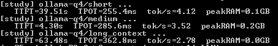
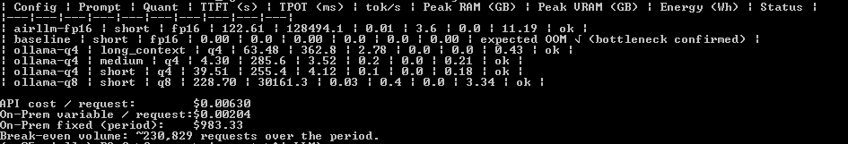
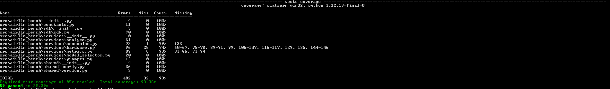
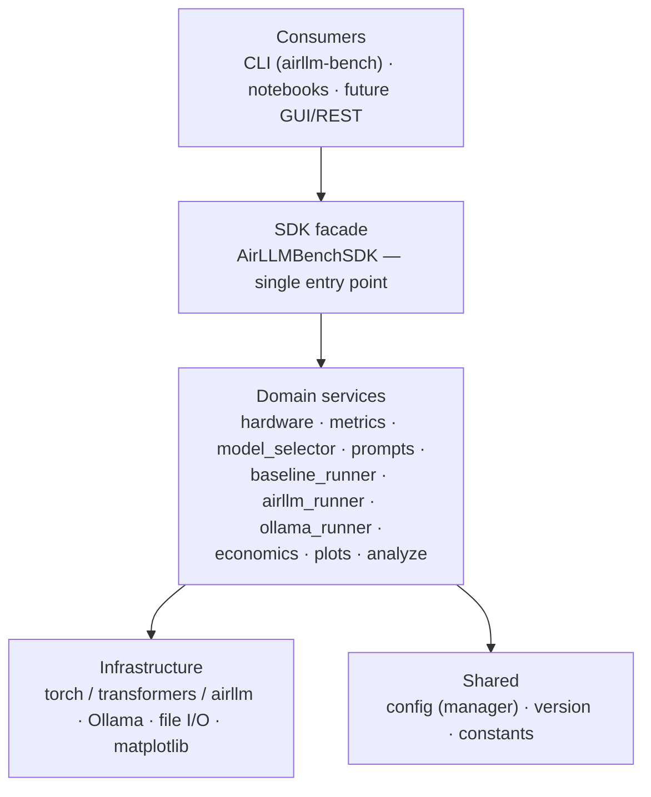

# EX05 — Running a Massive LLM Locally: AirLLM, Quantization & Performance Benchmarking

> Course L08 · Dr. Yoram Segal · June 2026
> A reproducible, instrumented experiment that runs a large language model
> **on-premises** on a modest 8 GB laptop using **AirLLM** layer-streaming, plus
> a **GGUF quantization** comparison via Ollama, analysed both technically and
> economically.

**Hebrew version:** see [`README.he.md`](README.he.md).
**Full technical report:** [`reports/report.md`](reports/report.md) (EN) ·
[`reports/report.he.md`](reports/report.he.md) (HE).

> ⏳ **Status of the numbers below.** Hardware specs (`results/hardware.json`)
> and the economic / roofline figures are **real and committed**. The
> performance tables (TTFT/TPOT/throughput/RAM) are marked **PENDING** until the
> model runs are executed on the target machine — see [Reproduce](#reproduce).
> No invented measurements are committed; every performance figure regenerates
> from `results/*.json` via `python -m analysis.analyze`.

---

## 1. Hardware spec & model choice (Task 5.1)

Auto-detected by `python -m src.hardware` → [`results/hardware.json`](results/hardware.json):

| Field | Value (this machine) |
|---|---|
| OS | Windows 10 |
| CPU | Intel Core i7-7500U @ 2.70 GHz — **2 physical / 4 logical cores** |
| RAM | **7.9 GB** total |
| GPU / VRAM | NVIDIA GeForce GTX 950M / **2.0 GB** (Maxwell, compute 5.0) |
| Disk | **SSD** (Micron 1100 SATA), ~40 GB free |
| Python | 3.12 (uv-managed; pinned `>=3.10,<3.13`) |

**Model chosen:** `Qwen/Qwen2.5-7B-Instruct`.
**Why this is the right "big enough to hurt, not impossible" pick *for this machine*:**
its FP16 footprint (~15 GB) **far exceeds the 7.9 GB RAM**, so the naive baseline
is guaranteed to fail (the bottleneck is real and demonstrable). Yet its
per-layer shards fit the ~40 GB SSD and a single transformer layer fits in RAM —
exactly the regime where AirLLM earns its keep. A 14B/32B model would not fit the
free disk once shards are written; 72B is far out of reach. `src.model_selector`
reproduces this reasoning from the detected RAM + free disk.

---

## 2. What the experiment does

1. **Baseline (Task 5.2)** — load the model the naive way
   (`transformers.AutoModelForCausalLM`, full FP16 weights). On 7.9 GB RAM this
   OOMs / thrashes swap. **That failure is the bottleneck evidence**, captured
   verbatim in `results/baseline_*.json`.
2. **AirLLM (Task 5.3)** — the same prompt through AirLLM, which streams **one
   transformer layer at a time** from the SSD. This is the FP16 layer-streaming
   demonstration that makes the otherwise-impossible model run.
3. **Quantization comparison (Task 5.3)** — **Q4 vs Q8 GGUF via Ollama**
   (llama.cpp, CPU). *Why not AirLLM's own q4/q8?* That path needs `bitsandbytes`
   with a CUDA GPU of compute capability ≥ 7.5 and several GB VRAM; the GTX 950M
   (Maxwell 5.0, 2 GB) cannot run it — a documented hardware limitation. GGUF on
   CPU gives the real quantization numbers instead.
4. **Measure (Task 5.4)** — TTFT, ITL/TPOT, throughput, peak RAM/VRAM, energy.
5. **Economics (Task 5.5)** — On-Prem CAPEX/OPEX vs third-party API, with
   optional cloud-GPU and prompt-caching scenarios; compute the break-even volume.

Measurement tools: a background `MemorySampler` thread (peak RSS + CUDA peak), a
streaming timer for TTFT/per-token gaps, Ollama's native ns-precision counters
for the GGUF runs, and `matplotlib` for all figures.

---

## 3. Results summary (measured)

`airllm-bench analyze` writes `results/summary_table.md` and the figures from the
raw `results/*.json`. Real measurements on the machine in §1
(Qwen2.5-7B-Instruct, "short" prompt, 20 output tokens):

| Config | Quant | TTFT (s) | TPOT (ms) | tok/s | Peak RAM (GB) | Energy (Wh) | Status |
|---|---|---|---|---|---|---|---|
| baseline (HF direct) | fp16 | — | — | — | — | — | **FAILED — OS-killed during load (OOM)** |
| airllm | fp16 | 129.48 | 144,190 | 0.01 | 3.6 | 12.49 | ok |
| ollama (GGUF) | q4 | 44.44\* | 245.1 | **4.29** | 1.8 | 0.20 | ok |
| ollama (GGUF) | q8 | 272.43 | 30,546 | 0.03 | 1.8 | 3.55 | ok |

\* Q4's TTFT here includes the **one-time model load into RAM** (~40 s on first
call); the warm prefill is ~3.8 s — see the input-length study below.

**Reading the data.**
- **Baseline fails:** the 15 GB FP16 model cannot be placed in 8 GB RAM with
  offloading forbidden — the OS kills the load. This *is* the memory-capacity
  bottleneck (recorded in `results/baseline_short.json`).
- **AirLLM enables it, slowly:** the same model runs in just **3.6 GB peak RAM**
  by streaming one layer at a time from the SSD — but each token re-reads all
  layers from disk, so decode is ~**144 s/token** (0.01 tok/s). Classic
  disk-I/O-bound behaviour.
- **Quantization + fitting in RAM is the real win:** **Q4 (~4.4 GB) fits in RAM**
  → **4.29 tok/s** decode (245 ms/token, **~590× faster** than AirLLM's 144 s) at
  ~0.20 Wh/request (**~60× less energy** than AirLLM's 12.49 Wh).
- **The RAM cliff:** **Q8 (~8 GB) does *not* fit** → llama.cpp pages it from disk
  every token → collapses to 0.03 tok/s (~125× slower than Q4). The decisive
  factor is not the quantization level itself but **whether the working set fits
  in RAM**.

> Note: Ollama runs in a separate process, so its "Peak RAM" is a whole-system
> used-RAM delta (mmap-backed paging makes Q8's resident delta look small) — a
> documented caveat, not a contradiction. See `docs/PRD_quantization.md`.


### Parameter study — TTFT vs input length (Task 5.7 secondary extension)

Ollama Q4 across three prompt lengths (`airllm-bench study`). Reading the **warm**
runs (the first call also pays the one-time model load), prefill cost (TTFT)
clearly grows with input length while decode (TPOT) stays roughly flat — exactly
the compute-bound-prefill / memory-bound-decode split:

| Prompt | Input tokens | TTFT (s) | TPOT (ms) | tok/s |
|---|---|---|---|---|
| short | ~12 | 44.44 (incl. cold-start load) | 245.1 | 4.29 |
| medium (warm) | ~40 | 3.83 | 271.3 | 3.71 |
| long_context (warm) | ~1600 | 57.06 | 286.6 | 3.52 |


### Run evidence (screenshots)

| Parameter study | Analysis output | Tests passing |
|---|---|---|
|  |  |  |

---

## 4. Inference-concept analysis (Task 5.6)

- **Prefill = TTFT.** Building the KV-cache over the prompt is one big parallel
  matmul → **compute-bound**. Watch TTFT grow with the `long_context` prompt.
- **Decode = TPOT.** Each new token streams the whole model's weights through
  memory once → **memory-bound**. With AirLLM those weights come from the *SSD*,
  so decode is bound by disk read bandwidth — the dominant cost here.
- **AirLLM ≈ OS virtual memory / paging**, but for *model layers*: only the
  "page" (layer) you need is resident; the rest lives on disk. The disk becomes
  the true bottleneck, not RAM size.
- **Quantization** shrinks each weight (FP16→Q4 ≈ 4× smaller), cutting the bytes
  moved per token → faster decode and lower peak memory, until accuracy degrades.


---

## 5. Economic analysis & recommendation (Task 5.5)


Two transparent cost models in [`analysis/economics.py`](analysis/economics.py),
all assumptions editable and stated:

- **API:** `requests × (in·price_in + out·price_out)`, with optional
  **prompt-caching** discount on the repeated prefix (providers charge far less
  for cached prefix tokens — this *shifts the break-even rightward*).
- **On-Prem:** amortized hardware CAPEX + electricity (from the **measured**
  Wh/request) + maintenance.
- **Optional cloud GPU:** hourly rate × seconds/request.

With the committed default assumptions the computed break-even is
**≈ 230k requests** over the amortization period: below that the API wins on pure
cost; above it On-Prem wins — *before* accounting for privacy, data security, and
offline availability, which can favour On-Prem regardless of volume. **Edit the
prices/tariff/lifetime in `config/setup.json` (the `economics` section) to your
cited values; the energy/request must come from your measured runs.**

---

## 6. Extensions (Task 5.7)

This project's required original extension is the **GGUF-via-Ollama quantization
track** (§2.3): it makes a real Q4/Q8 comparison achievable on a GPU that cannot
run bitsandbytes, and contrasts two fundamentally different local-inference
engines (AirLLM disk-streaming vs llama.cpp CPU quantization). The
`long_context` prompt additionally supports a TTFT-vs-input-length sweep.

---

## Reproduce

Everything runs through the `uv`-managed `airllm-bench` CLI (a thin consumer of
the `AirLLMBenchSDK` facade). All tunables live in `config/setup.json`.

```powershell
# 1. Environment (uv only). Windows PowerShell shown; bash is analogous.
uv venv
uv pip install -e .                      # heavy: torch, transformers, airllm, ...

# 2. Document hardware + see the recommended model (already committed, real)
uv run airllm-bench hardware
uv run airllm-bench model

# 3. (optional) Point AirLLM shards at a drive with room (defaults to .\layer_shards)
#    PowerShell:  $env:AIRLLM_SHARDS = "D:\airllm_shards"   (or edit config/setup.json)

# 4. Run experiments
uv run airllm-bench baseline             # naive load -> expected OOM = the bottleneck
uv run airllm-bench airllm               # FP16 layer-streaming

# 5. Quantization comparison via Ollama/GGUF (install the Ollama app first)
uv pip install ollama
uv run airllm-bench ollama               # Q4 + Q8 on CPU

# 5b. Parameter study: TTFT vs input length (Ollama Q4 across short/medium/long)
uv run airllm-bench study

# 6. Build tables + figures + economics
uv run airllm-bench analyze
#  ... or do steps 4-6 in one go:
uv run airllm-bench all

# Quality gates
uv run ruff check .
uv run pytest                            # 55 tests, >=85% coverage gate
```

### Known pitfalls (from the assignment's Do/Don't list)
- **Python 3.13 is too new** for AirLLM/bitsandbytes — this project pins
  `>=3.10,<3.13` (uv selects 3.12).
- **transformers must stay `<4.45`.** AirLLM 2.11 hard-imports
  `optimum.bettertransformer`, which breaks on transformers 5.x (removed
  `is_tf_available`). `pyproject.toml` pins `transformers>=4.44,<4.45`,
  `optimum<2.0`, and `sentencepiece` (needed by an AirLLM tokenizer import). If
  you ever see `cannot import name 'is_tf_available'` or
  `No module named 'optimum.bettertransformer'`, your transformers/optimum drifted
  too new — reinstall with `uv pip install -e .`.
- **Point `layer_shards_saving_path` at a drive with space** — shards are ~15 GB
  of SafeTensors for 7B and flood `C:` otherwise. Only ~40 GB is free here, so
  watch disk during the AirLLM run.
- Use **`airllm.AutoModel`** (the general class) to avoid the class-mismatch
  error with `Qwen`-family models.
- **Never commit your Hugging Face token** — `.gitignore` excludes tokens, the
  venv, model shards, and `*.safetensors`/`*.gguf`.
- Start small (low `max_new_tokens`) to confirm the "pipe" works, then scale.
- **Be patient:** on this 8 GB / SATA-SSD machine, AirLLM reads ~15 GB from disk
  *per token*; expect tens of seconds per token. Keep `max_new_tokens` modest.

---

## Repository layout

```
README.md / README.he.md     project docs (this file)
pyproject.toml · uv.lock      uv project, pinned deps, console script (airllm-bench)
.env-example                  secret placeholders (no secrets committed)
config/                       setup.json · rate_limits.json · logging_config.json (versioned)
docs/                         PRD.md · PLAN.md · TODO.md · PRD_<mechanism>.md · PROMPT_LOG.md
src/airllm_bench/             the package (SDK architecture)
  ├─ sdk/sdk.py               SDK facade — single entry point for ALL logic
  ├─ services/                hardware · metrics · model_selector · prompts ·
  │                           baseline_runner · airllm_runner · ollama_runner ·
  │                           economics · plots · analyze
  ├─ shared/                  config.py (config manager) · version.py
  ├─ constants.py             immutable maps/enums
  └─ main.py                  CLI (consumes the SDK)
tests/                        unit/ (pytest, >=85% coverage) + conftest.py
results/                      hardware.json (real) + raw per-run JSON + summary_table.md
figures/                     generated PNGs (economics/roofline real; perf pending)
reports/                     report.md (EN) + report.he.md (HE)
```

> **Architecture note (guidelines §4/§5):** all business logic is reached through
> `AirLLMBenchSDK`; consumers never import services directly. The **API Gatekeeper
> is documented as N/A** — this project makes no live third-party API calls (the
> economic analysis uses published per-token prices on paper). See `docs/PLAN.md`.

### Architecture diagram (SDK-fronted, layered)



---

## License & Credits

- **License:** MIT — see [`LICENSE`](LICENSE).
- **Author:** Amjad Abed Alrahim · University of Haifa · Course L08.
- **Assignment & guidelines:** Dr. Yoram Segal (EX05; "Guidelines for Writing
  Professional Software"). © Dr. Yoram Segal — used here for the course submission.
- **Third-party software:** [AirLLM](https://github.com/lyogavin/airllm),
  [Hugging Face Transformers](https://github.com/huggingface/transformers),
  [PyTorch](https://pytorch.org), [Ollama](https://ollama.com) /
  [llama.cpp](https://github.com/ggerganov/llama.cpp), and the
  [Qwen2.5](https://huggingface.co/Qwen) model family — each under its own license.
- **Built with** Vibe Coding (AI-assisted); see [`docs/PROMPT_LOG.md`](docs/PROMPT_LOG.md).
- **Rubric compliance & self-score:** [`docs/SELF_ASSESSMENT.md`](docs/SELF_ASSESSMENT.md).
