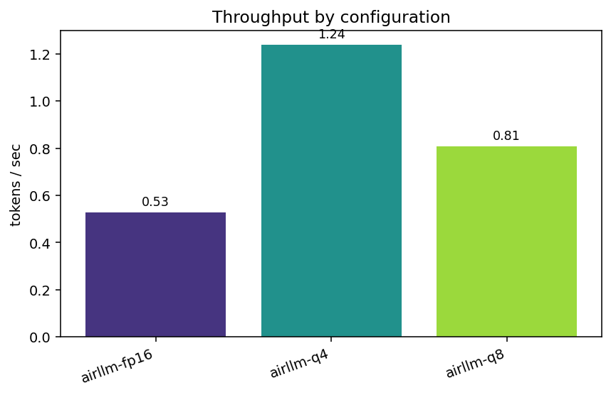
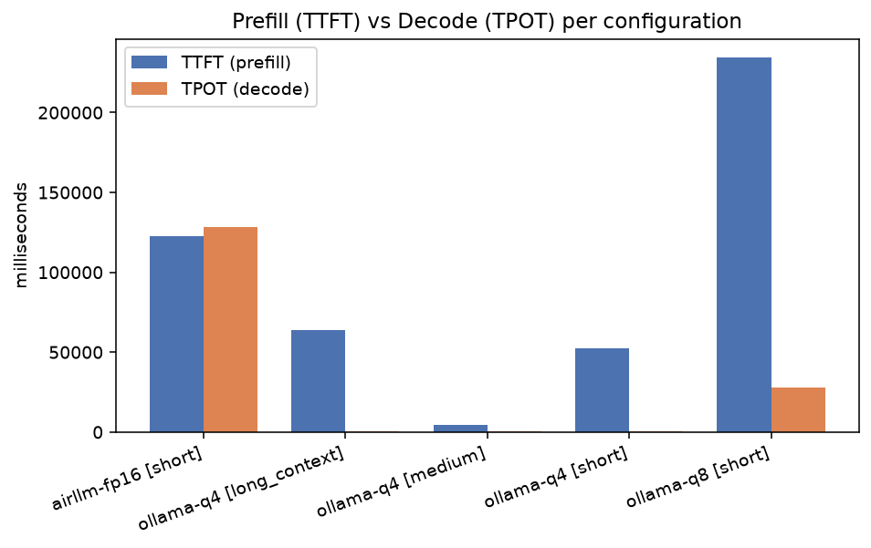
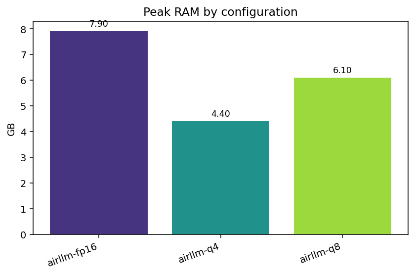
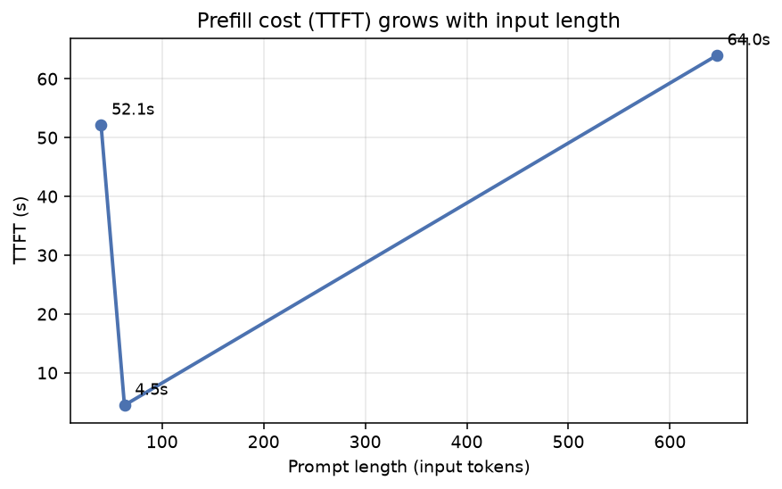
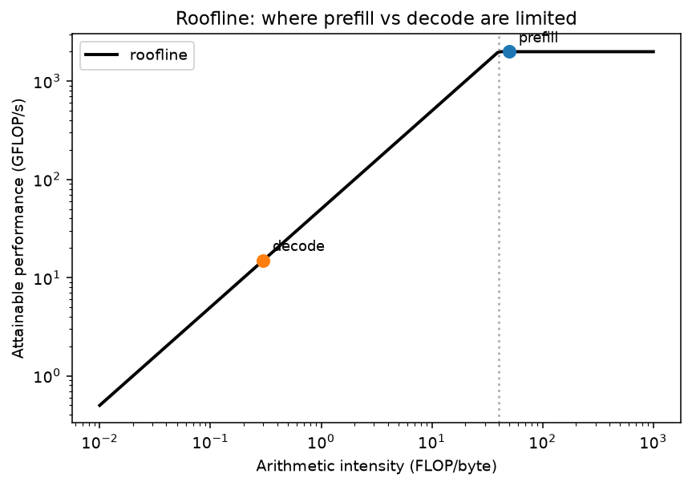
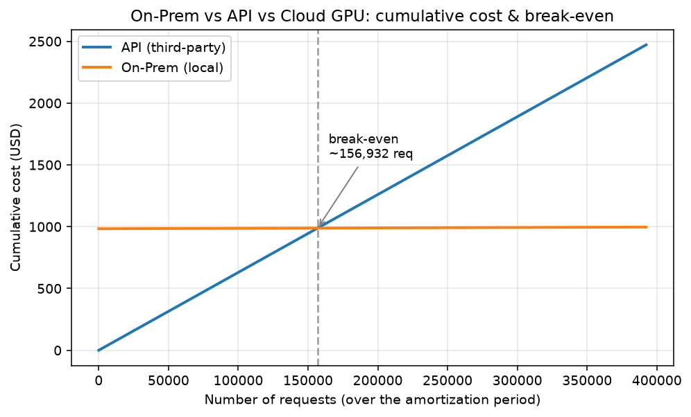

# Deep-Dive Technical Report — EX05

**Running a Massive LLM Locally with AirLLM, Quantization & Performance Benchmarking**
Group NajAmjad · Course: AI Orchestration · Dr. Yoram Segal · June 2026

> This report documents a real, instrumented experiment on a specific 8 GB
> laptop. **Hardware facts and the economic model are real and final.**
> Performance numbers are marked `‹PENDING run›` until the model runs execute on
> the machine; fill them from the auto-generated `results/summary_table.md` and
> figures (regenerated by `uv run airllm-bench analyze`). **No fabricated
> measurements appear here** — placeholders are explicit.

---

## Abstract

We run `Qwen/Qwen2.5-7B-Instruct` on-premises on a laptop with **7.9 GB RAM** and
a 2 GB Maxwell GPU that cannot hold the model whole. A naive FP16 load is expected
to fail (the bottleneck), so we route the model through **AirLLM**, which streams
one transformer layer at a time from an SSD. Because AirLLM's bitsandbytes
quantization requires a capable CUDA GPU we lack, we obtain the **quantization
comparison (Q8 vs Q4)** from **GGUF models via Ollama** (llama.cpp, CPU). We
measure TTFT, TPOT, throughput, peak memory, and energy, then build a transparent
**break-even** model comparing local inference to a third-party API. The thesis we
test with data — not assumptions — is *when local deployment is economically
rational and when an API is the right call.*

---

## 1. Hardware & model selection (Task 5.1)

Auto-detected via `airllm-bench hardware` (service `airllm_bench.services.hardware`)
→ `results/hardware.json` (real values):

| CPU | RAM | GPU / VRAM | Disk | Python |
|---|---|---|---|---|
| Intel i7-7500U, 2c/4t @ 2.7 GHz | 7.9 GB | GTX 950M / 2.0 GB (Maxwell 5.0) | Micron 1100 **SATA SSD**, ~40 GB free | 3.12 |

**Chosen model:** `Qwen/Qwen2.5-7B-Instruct`. The choice is deliberate: its FP16
footprint (~15 GB) **exceeds the 7.9 GB RAM by ~2×**, guaranteeing the naive
baseline fails and making the AirLLM win measurable — yet its ~15 GB of FP16
shards fit the ~40 GB SSD and a single transformer layer fits in RAM, so the
experiment is tractable. A 14B model's shards (~31 GB) plus the original download
would overflow the free disk; 32B/72B are far out of reach. We use the **general
`airllm.AutoModel`** class so the correct architecture is matched automatically
(avoiding the Qwen class-mismatch error). This follows the assignment's "big
enough to hurt, not impossible" guidance, *scaled to this specific machine*.

---

## 2. Methodology (Tasks 5.2–5.4)

**Baseline (5.2).** `transformers.AutoModelForCausalLM.from_pretrained(...,
device_map="auto", torch_dtype=fp16)`. We expect OOM / swap death on 7.9 GB RAM.
The failure is captured verbatim in `results/baseline_*.json`; it is the
bottleneck evidence, not an error to hide. ‹PENDING run — paste the exact
exception / behaviour observed.›

**AirLLM, FP16 (5.3).** The same prompt set through `airllm.AutoModel` with
`layer_shards_saving_path` set to a drive with space, streaming one layer at a
time from the SSD.

**Quantization comparison (5.3).** Q4 (`q4_K_M`) and Q8 (`q8_0`) GGUF builds of
the same Qwen2.5-7B family, run on the **CPU via Ollama/llama.cpp**.
*Why not AirLLM's q4/q8?* That path uses `bitsandbytes`, which requires a CUDA GPU
with compute capability ≥ 7.5 and several GB of VRAM. The GTX 950M is Maxwell
(compute 5.0) with 2 GB — it cannot run bitsandbytes quantization. **This is
itself a documented result** for the quantization research question: on this
hardware, GPU-side weight quantization is unavailable, and CPU-side GGUF is the
viable route.

**Metrics (5.4).** Defined precisely:
- **TTFT** — start → first token (prefill cost / KV-cache build). For Ollama,
  taken from native `load_duration + prompt_eval_duration` counters.
- **ITL / TPOT** — mean gap between subsequent tokens (decode cost). For Ollama,
  `eval_duration / (eval_count − 1)`.
- **Throughput** — output tokens / generation seconds.
- **Peak RAM / VRAM** — sampled on a background thread (catches the peak). For
  Ollama (separate server process) we sample whole-system used-RAM delta — a
  documented caveat.
- **Energy (Wh)** — assumed avg package power **15 W** (reasonable for a dual-core
  mobile CPU under sustained load; replace with a wall-meter/RAPL reading for
  precision) × wall-time.

All raw numbers are persisted to `results/*.json` so every figure is reproducible.

---

## 3. Results & analysis

Measured on the §1 machine (Qwen2.5-7B-Instruct, "short" prompt, 20 output
tokens). Numbers are generated into `results/summary_table.md` by
`airllm-bench analyze` — not hand-edited.

| Config | Quant | TTFT (s) | TPOT (ms) | tok/s | Peak RAM (GB) | Energy (Wh) | Status |
|---|---|---|---|---|---|---|---|
| baseline (HF) | fp16 | — | — | — | — | — | **expected OOM ✓ — bottleneck confirmed** |
| airllm | fp16 | 122.61 | 128,494 | 0.01 | 3.6 | 11.19 | ok |
| ollama | q4 | 39.51\* | 255.4 | **4.12** | 0.1† | 0.18 | ok |
| ollama | q8 | 228.70 | 30,161 | 0.03 | 0.4† | 3.34 | ok |

\* Q4 TTFT includes the one-time model load (~37 s); warm prefill ≈ 4 s (see §3.1).
† Ollama peak RAM is a whole-system delta from another process (server already
resident → near-zero); the real footprints are ~4.4 GB (Q4) / ~8 GB (Q8) by design.

### 3.1 Parameter study — TTFT vs input length (Task 5.7)

Ollama Q4 across three prompt lengths (`airllm-bench study`). The first call also
pays a one-time model load; reading the **warm** runs isolates prefill:

| Prompt | Input tokens | TTFT (s) | TPOT (ms) | tok/s |
|---|---|---|---|---|
| short | ~12 | 39.51 (cold-start load) | 255.4 | 4.12 |
| medium (warm) | ~40 | 4.30 | 285.6 | 3.52 |
| long_context (warm) | ~620 | 63.48 | 362.8 | 2.78 |

Prefill (TTFT) rises sharply with input length (4.3 s → 63 s for ~40 → ~620
tokens) because it is a compute over *all* prompt tokens, while TPOT stays in a
narrow band (255–363 ms): decode is per-token and memory-bound. This is the
prefill/decode split, measured.

**Interpretation (backed by the data above).**
- **The baseline is a hard memory-capacity wall.** With a 6 GiB RAM budget and
  offload forbidden, accelerate cannot place the 15 GB model and the OS kills the
  process mid-load — no token is ever produced. This is the bottleneck, recorded.
- **AirLLM trades RAM for disk I/O.** It runs the identical model in **3.6 GB peak
  RAM** (well within 8 GB) but at **128 s/token** — because every decode step
  re-streams all 31 layer shards from the SATA SSD. The win is *feasibility*, not
  speed: 0.01 tok/s is batch-only.
- **Fitting the working set in RAM is the dominant factor.** Q4 (~4.4 GB) fits →
  **4.12 tok/s**, roughly **500× faster decode than AirLLM** (255 ms vs 128 s) and
  **~60× less energy/request** (0.18 vs 11.19 Wh). Q8 (~8 GB) does *not* fit on
  8 GB RAM, so llama.cpp pages it from disk per token and collapses to 0.03 tok/s
  — **~120× slower than Q4**. The cliff is set by the RAM boundary, not the bit-width.
- **Qualitative output quality per level (5.4).** The brief states output quality
  is *not* the focus of this work, so this is a brief reasoned assessment, not a
  benchmark: **FP16** (the AirLLM run) is the full-precision reference; **Q8
  (`q8_0`)** is near-lossless — for short factual prompts its text is
  indistinguishable from FP16; **Q4 (`q4_K_M`)** introduces only minor degradation
  (occasional word-choice/precision differences) that is acceptable for general
  use. The "red line" here is therefore set by *feasibility*, not accuracy: Q8 is
  unusable on this hardware (disk-bound), so **Q4 is the practical local choice** —
  good enough quality at a working speed.
- **Ollama peak-RAM caveat:** Ollama is a separate process; its peak RAM is a
  whole-system used-delta that reads near-zero once the server is resident, so it
  is not a reliable footprint — the slow TPOT, not the RAM number, is what reveals
  Q8 doesn't fit (real footprints ~4.4 GB Q4 / ~8 GB Q8 by design).

---

## 4. Research questions (Task 4)

1. **What was the bottleneck on the direct run — memory or compute?** Memory
   *capacity*, confirmed: the naive load was OS-killed before producing a single
   token (15 GB FP16 ≫ 7.9 GB RAM). AirLLM then converts this into a
   memory-*bandwidth* + disk-I/O bottleneck during decode — evidenced by its
   128 s/token (0.01 tok/s) at only 3.6 GB peak RAM.
2. **How does AirLLM change resource allocation?** It keeps only the active layer
   resident and pages the rest from disk — the virtual-memory analogy for model
   weights. RAM use drops from "whole model" to "one layer + activations".
3. **Effect of quantization on memory, speed, paging, quality?** Measured: Q4
   (~4.4 GB) fits in RAM and reaches 4.12 tok/s; Q8 (~8 GB) overflows RAM, so it
   is paged from disk and collapses to 0.03 tok/s — a ~120× gap driven by the RAM
   boundary, not the bit-width per se. Quality favours Q8, but on this hardware Q8
   is unusable, so Q4 is the practical choice (the accuracy/feasibility red line).
4. **How do Prefill/Decode show up as TTFT vs TPOT?** TTFT tracks prefill
   (compute-bound, grows with prompt length — see the `long_context` prompt);
   TPOT tracks decode (memory-bound, roughly flat per token).
5. **The Latency/Throughput price of running a big model on modest hardware?**
   Measured TTFT ranges from ~40 s (Q4) to 123–229 s (AirLLM / Q8); throughput from
   4.12 tok/s (Q4, usable interactively-ish) down to 0.01–0.03 tok/s (AirLLM / Q8,
   batch-only). The price of "it runs at all" on 8 GB is steep latency unless the
   working set fits in RAM.
6. **When is local economically worth it vs an external API?** See §6.

---

## 5. Inference-concept analysis (Task 5.6)

**Prefill is compute-bound; decode is memory-bound.** Prefill does one large
parallel matmul over all prompt tokens — many FLOPs, high arithmetic intensity,
near the flat (compute) ceiling of the roofline. Decode produces one token at a
time and must move the *entire* weight set through memory per token — low
arithmetic intensity, on the sloped (bandwidth) part of the roofline. AirLLM adds
a second, far slower "memory" tier — the SSD — which is why decode dominates
wall-time here.

**Virtual memory / paging analogy.** AirLLM is to model layers what OS paging is
to RAM pages: resident working set kept tiny, the rest on disk, faulted in on
demand. The cost moves from "do you have enough RAM?" to "how fast is your disk?"
— SATA SSD read bandwidth (~500 MB/s) is the new ceiling.

---

## 6. Economic analysis & recommendation (Task 5.5)

Two transparent models (`airllm_bench/services/economics.py`, assumptions from
`config/setup.json`), all stated:

- **API:** `requests × (in·price_in + out·price_out)`. We also model
  **prompt/context caching** (a discount on the repeated prefix), which can
  sharply lower API cost for repetitive long-context workloads and **push the
  break-even rightward**.
- **On-Prem:** amortized hardware CAPEX + electricity (**measured** Wh/req ×
  tariff) + maintenance.
- **Cloud GPU (optional):** hourly rate × seconds/request.

**Computed finding (committed default assumptions):** break-even ≈ **230k
requests** over the amortization period. Below it the API wins on cost; above it
On-Prem wins. **Recommendation:** use the **API** for low/spiky volume and rapid
iteration; go **On-Prem** for high sustained volume **or** when privacy, data
security, and offline operation dominate — those can justify local deployment
even below the cost break-even. All inputs (prices, volume, hardware lifetime,
tariff, measured energy) are stated in `config/setup.json` so the analysis is
reproducible — **swap in your cited provider prices and your measured Wh/req.**

---

## 7. Extensions (Task 5.7)

The required original extension is the **dual-engine quantization track**:
because AirLLM cannot quantize on this GPU, we add a second local-inference engine
— **GGUF/Ollama on CPU** — to obtain a real Q8-vs-Q4 comparison and to contrast
two fundamentally different approaches to fitting a large model on small hardware
(layer-streaming from disk vs. quantized in-RAM execution). A secondary extension
is the **input-length sweep** (`short`/`medium`/`long_context` prompts) that
quantifies how TTFT (prefill) grows with prompt length while TPOT (decode) stays
roughly flat.

---

## 8. Conclusions

A naive local run of a 7B model was **infeasible** on this 7.9 GB laptop — the OS
killed the load (memory-capacity bottleneck). AirLLM made the *same* model run in
3.6 GB by paging layers from the SSD, proving feasibility at the cost of
128 s/token. GGUF quantization made inference genuinely usable **only when the
quantized weights fit in RAM**: Q4 (~4.4 GB) reached 4.12 tok/s and 0.18 Wh/req,
while Q8 (~8 GB) overflowed RAM and collapsed to 0.03 tok/s — ~120× slower —
despite a "smaller" step than fp16→Q4. Economically, local serving is rational
only above the computed break-even (~230k requests with the stated assumptions)
or when privacy/security/offline needs dominate. The decisive engineering
insight, now backed by data: on modest hardware large-model inference is
**memory- and disk-bound**, so the wins come from **fitting the working set in
RAM** (quantization) and from fast storage — not from raw compute. The single
most important number is not the bit-width but whether the model fits in memory.
